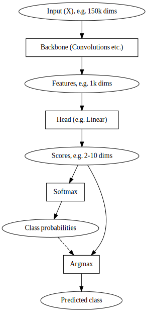

Overview of drift detection
===========================

What is drift?
--------------

To look into what drift is, consider the somewhat generic setting that
you have input data :math:`X` and (desired) output data :math:`Y`. These
are jointly distributed according to :math:`P(X,Y)`. Also, we have a
model :math:`f : x \mapsto y` which we hope maps :math:`x` to matching
:math:`y` and has been optimized to minimize some loss
:math:`E_{P(X,Y)}[L(Y, m(X))]`.

Our setting has drifted when the distribution :math:`P(X,Y)` is
different from a reference (e.g. during training) :math:`P_{ref}(X,Y)`.

The literature (see e.g. S. Zhao et al.: A Review of Single-Source Deep
Unsupervised Visual Domain Adaptation) distinguished between various
drift (or shift, if you want to take a more static view) types

-  Covariate or input drift: :math:`P(Y | X) = P_{ref}(Y | X)` but
   :math:`P(X) \neq P_{ref}(X)`,
-  Label drift: :math:`P(X | Y) = P_{ref}(X | Y)` but
   :math:`P(Y) \neq P_{ref}(Y)`,
-  Concept drift: :math:`P(Y | X) \neq P_{ref}P(Y | X)` (this differs
   from S. Zhao et al.).

These are not exclusive, e.g. when the class balance changes without the
class-conditional distributions changing, you would observe both
covarite and label shift.

There are several things we would want to do that are related to drift:
- In *domain adaptation* we try to make models which can cope with the
new distribution :math:`P`. - In *drift detection* (here) we are
interested in detecting whether drift has happened. It will be hard to
deal with concept drift because we typically do not have access to
:math:`Y` from :math:`P(Y)`, but we will see what can be done about the
others.

How do we detect drift?
-----------------------

When framed as above, drift detection is the question if
:math:`P(X,Y) \neq P_{ref}(X,Y)`. Given our setting, that we observe
samples from :math:`P(X,Y)` or :math:`P(X)` after previously observing
samples from :math:`P_{ref}(X,Y)`, it is natural to look at statistical
hypothsis for with the null hypothesis :math:`P(X, Y) = P_{ref}(X,Y)`.

But there are several difficulties: - We typically do not have :math:`Y`
(e.g. the ground truth label) from :math:`P`. - The inputs :math:`X`
typically are very high-dimensional - e.g. a 224x224 RGB picture is a
150’000 dimensional input.

The curse of dimensionaly, this old nemesis of machine learning, makes
directly testing with :math:`X` more or less infeasible.

So :math:`X` is all we have, and that is too high-dimensional to work
with directly. But this means that we have to reduce the dimensionality.

In summary, - We typically need to work with :math:`X`. We assume that
we have a (sizeable) sample from :math:`P_{ref}(X)` and also get a
sample from :math:`P(X)` to decide with. - We need a way to reduce the
dimensionality. - We need a statistical test for :math:`P = P_{ref}`.

We treat the first as a given and reflect a bit on the the other two
parts.

Dimension reduction
-------------------

There are two main ways to do do the dimension reduction.

An obvious choice might be to turn to estabilished methods for dimension
reduction. There are plenty of them, the simplest is perhaps the
principal component analysis (PCA). And indeed this is one of the routes
we will take.

So what else can we do? Well, if the thing we are doing is, say, a
classification problem, we had the same problem before: We wanted to
have a class boundary but could not describe it on :math:`X` directly.
Instead we trained our model function :math:`m`.

But before we think we need to train a model for drift detection, we
likely want to look at the one we already have, the model :math:`m` for
our original task.

A typical model working on images might look like this:

Here, the model components are in boxes and the input, output and
intermediate values are in ellipses.

If :math:`X` at the very top is not a good candidate, so we might use
any other - the features, the scores, the class probabiities or (at
least we might conceptually) the predicted class.

But we could also avoid using the model :math:`m` for our task and
replace it with another, e.g. a feature extractor trained in a
self-supervised fashion or an a different task like ImageNet. One such
auxilliary type of models that has been used are autoencoders.

There is a variant of this scheme where one uses an untrained model
rather than a trained one, it is sometimes called the *Untrained
AutoEncoder* or *UAE*, making the more traditional autoencoder use
alluded to above the *trained autoencoder*.

So this is how we might use a neural network for dimension reduction. Of
course, we might also look at models beyond neural networks for this.

We have framed using a neural network as a method for merely reducing
dimensions. This is an important aspect, but one might also hope that
they can help in distinguishing meaningful drift from hypothetical
change. The flip side, of course, is the danger that they might be
“blind” to a change that we are interested in.

In other applications such as natural language processing (NLP), there
is one other aspect of how neural networks work that we want to also use
for the drift detection: Embedding layers help getting the inputs
:math:`X` into a form that we can apply our drift detection mechanisms
to.

In summary, dimension reduction is typically accomplished by

-  an established dimension reduction method such as PCA,
-  using a model, e.g. (parts of) the model for the original task.

Of course, we might also mix the two approaches — using a model first
and then doing the last bit with the usual dimension reduction methods.

Hypothesis testing and beyond
-----------------------------

For the hypothesis testing we have samples
:math:`x^{ref}_1, ..., x^{ref}_N` from :math:`P_{ref}(X)` and
:math:`x_1, ..., x_M` from :math:`P`. Note that we don’t expect these to
actually be the raw inputs :math:`X` but we simplify our life here and
ignore the dimension reduction / preprocessing in between. Each
:math:`x_i` lies in :math:`\mathbb{R^d}`, we assume that they are
indepent. The null hypothesis is that the two distributions agree,
i.e. :math:`P = P_{ref}`.

We already see two important parameters here: The number :math:`N` of
sample points from the reference and the number :math:`M` of sample
points to be tested. As a rule of thumb, more samples help in more
reliable testing, but we need to balance this with the compute
requirement and, perhaps even more importantly, the time and cost of
data acquisition. For the test data in particular, our desire to for
timely monitoring may limit how many samples we want to wait for.

Now we have two types of tests: - Some tests, such as the maximum mean
discrepancy test (`A. Getton et al.: A Kernel Two-Sample Test, JMLR
2012 <https://jmlr.csail.mit.edu/papers/v13/gretton12a.html>`__) can be
directly applied on the data for any :math:`d`, even if large :math:`d`
is undesirable. - The most classical tests like the two-sample
Kolmogorov-Smirnov test, are for one-dimensional data only. To use them,
we must either reduce the dimensions to one in the dimension-reduction
step of our drift detection pipeline or we help ourselves with the
kludge of just testing marginal distributions: We make :math:`d`
1-dimensional tests if the marginal distribution of the :math:`k`-th
components of the samples of the vector-valued random variables
:math:`X` and :math:`X_{ref}` are likely to have originated from
distinct distributions.

This loses power: First, the distribution might dramatically change
while the marginals stay the same, and we would have no way to detect
this change on the marginals. Secondly, we now make :math:`d` tests and
if we wish to compute p-values, we need to `adjust for
this <https://en.wikipedia.org/wiki/Multiple_comparisons_problem>`__.
The (computationally, but not necessarily philosophically) simplest
adjustment is a `Bonferroni
correction <https://en.wikipedia.org/wiki/Bonferroni_correction>`__,
where we divide the significance level (the p-value) by :math:`d` and
check if any test meets this harder significance criterion.

As the p-value gives us the expected rate of “false alarms” if the null
hypotheses *no drift* remains valid, just leaning on it does leave
something to be desired in terms of detection rates. In many practical
applications, we may not have samples of drifted data, so we have to
make to with the p-value only. If we do have access to (potentially
fabricated) samples from the drifted set, we can extend our analysis to
consider the `receiver operating characteristic (ROC)
curve <https://en.wikipedia.org/wiki/Receiver_operating_characteristic>`__,
so we can trade off the false positive rate against the statistical
sensitivity of the detector. Examples of this analysis are provided in
XXX.

We will discuss individual tests in XXX.

